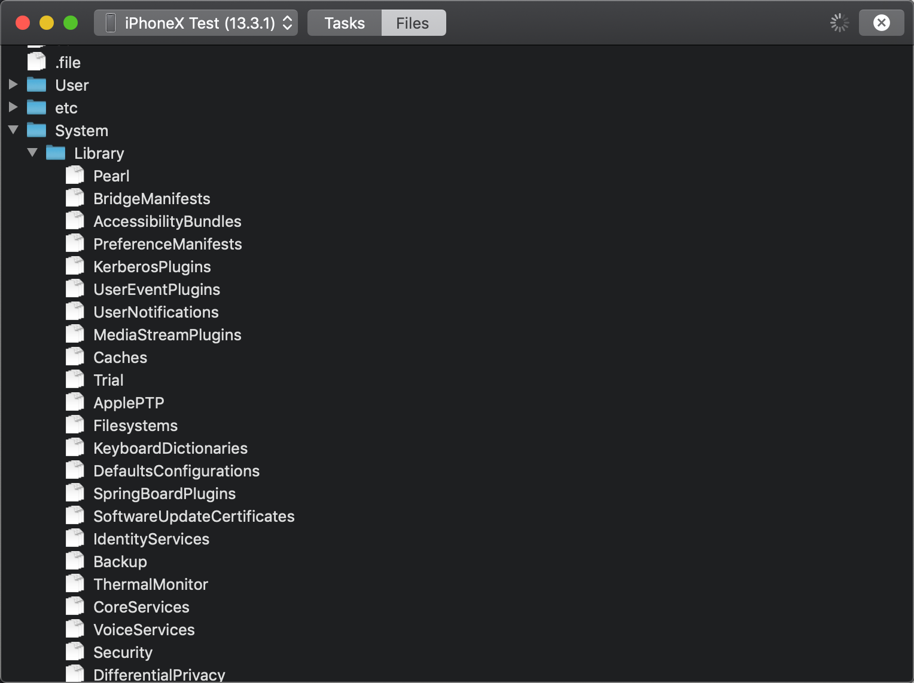

# Process Management and Directory Listing w/o jailbreak

This is based on legit features of Xcode Developer Disk Image.

## Process Management:

Just like `ps` and `kill`

## Directory Listing:

You still can't read anything from a file

