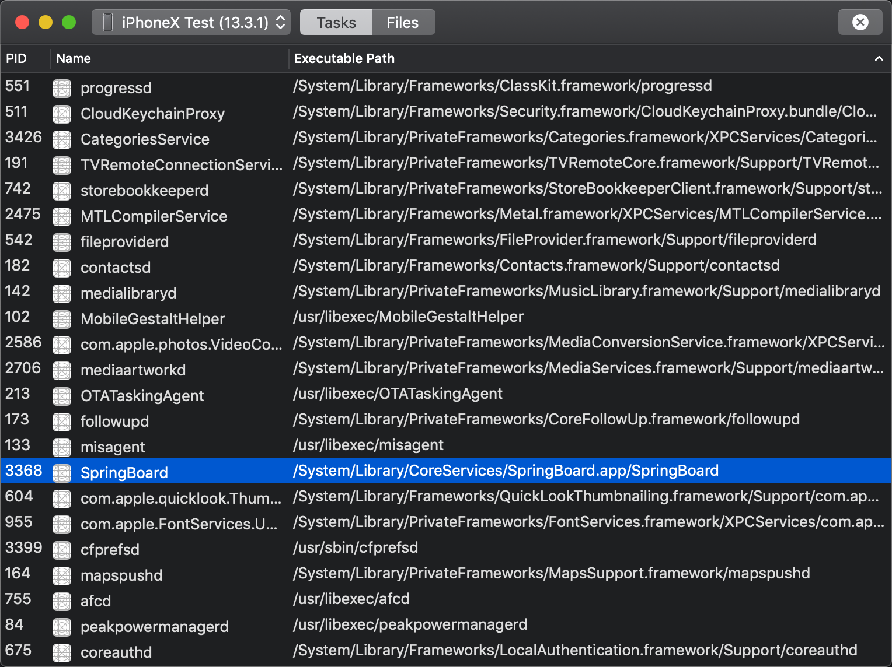
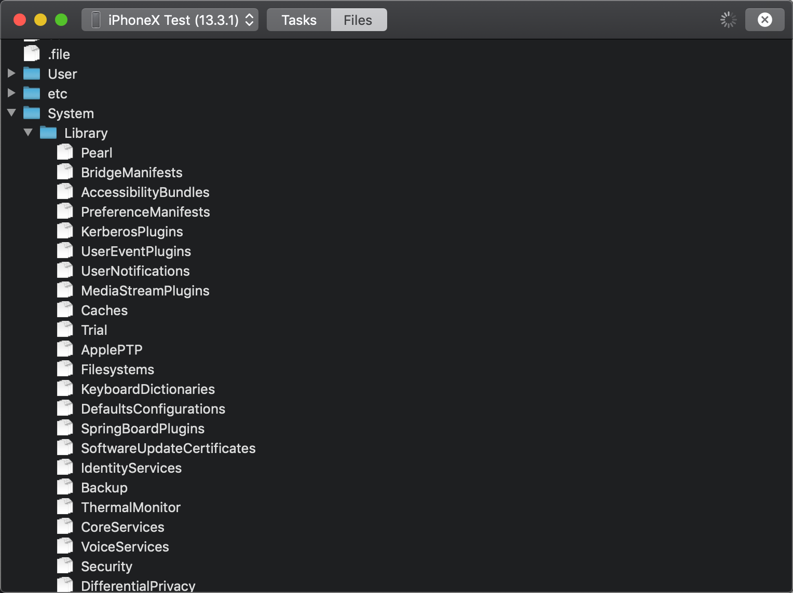

  

<h1 align="center">Tethered Task Manager</h1>

This is based on legitimate features of Xcode Developer Disk Image. Requires Xcode on macOS and USB connection to iPhone.

## Process Management:

Just like `ps` and `kill`

## Directory Listing:

Still, you can't read anything from a file

